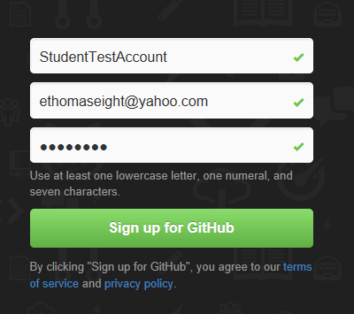
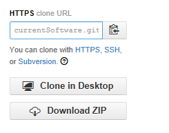

Tools for this course
=====================
The following tools will be used in this source:

1. Visual Studio Express 2012 for Windows Desktop
2. Git
3. Github
4. Google Test

Visual Studio 2012
------------------
Any version of Visual Studio 2012 which compiles C++ will work. I'm using Visual Studio Express 2012 for Windows Desktop. It can be downloaded [here](http://www.microsoft.com/en-us/download/details.aspx?id=34673). After downloading it, perform a full installation.

If you are not using Windows, any C++ compiler with support for the C++11 threading library will work.

Git
---
Git is a distributed version control utility. On Windows, I'm using MsysGit from [here](http://msysgit.github.io/), version 1.8.3.

Configure Git using the following commands:

<pre>
git config --global user.name "John Doe"
git config --global user.email johndoe@example.com
git config --global credential.helper "cache --timeout=3600"
</pre>

The first two commands set your user name and email address, used to mark commits. The last command will cache your Github password for one hour.

Github
------
Github is a website which provides free Git repository hosting, code sharing, and code review. I'll be pushing all of the code and notes for the course to Github.

* Browse to [http://github.com] (http://github.com) and sign up for an account (if you don't already have an account).

* Browse to the Github [site](https://github.com/joshpeterson/DevelopingConcurrentSoftware) for this course.
* Fork the repository

* Clone the repository to your machine, using your Git utility. Find the HTTPS URL for your repository.

    <pre>git clone https://github.com/YourUsername/DevelopingConcurrentSoftware.git</pre>

Google Test
-----------
Google Test is a C++ unit testing framework. To install it:

1. Browse to the Google Test [site](http://code.google.com/p/googletest/).
2. Download version 1.6.
3. Extract the .zip file to some location one your machine.
4. In the msvc directory, open the getst-md.sln file in Visual Studio 2012 (select Ok to perform the one-way project file upgrade, and acknowledge the security warning).
5. From the BUILD menu choose "Build Solution" to build the Debug target.
6. Switch Visual Studio to the Release target, and choose "Build Solution" again.

